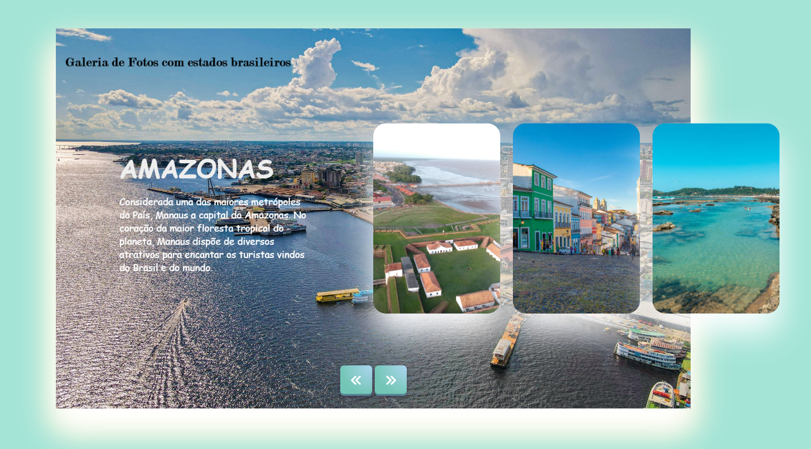

# Galeria de Fotos 📷

  

## 📃Descrição: 

Página web criada em formato de galeria de fotos como estados brasileiros como protagonistas e algumas das suas características marcantes.
  

## 🛠 Tecnologias:

As seguintes ferramentas foram usadas na construção do projeto:

- HTML

- CSS

- JAVASCRIPT

 
## Apresentação 🌺

##  Autora 🙆‍♀️

Maria Antonia Prates

##  Colaboradores 🤝

* Google Image

* Google Fonts

* Font Awesome

* Repositório Github https://github.com/deborapolesel/Album-de-fotos.git

* Canal "Creative JS Coder" no Youtube
